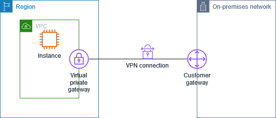
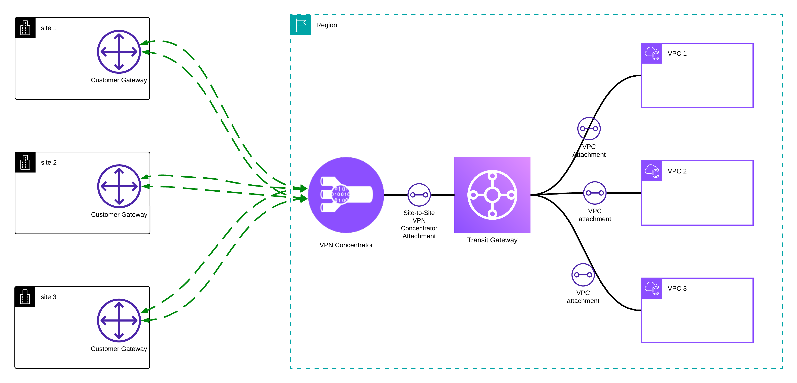

# AWS Site-to-Site VPN

## 개요

AWS Site-to-Site VPN은 온프레미스 네트워크와 AWS VPC(Virtual Private Cloud) 간에 암호화된 IPsec 터널을 통해 안전한 연결을 제공하는 서비스입니다. 이를 통해 기업은 기존 데이터센터의 리소스와 AWS 클라우드 리소스를 마치 하나의 네트워크처럼 사용할 수 있습니다.

## Site-to-Site VPN이란?

Site-to-Site VPN(S2S VPN)은 두 개의 서로 다른 네트워크를 인터넷을 통해 안전하게 연결하는 기술입니다. 일반적인 인터넷 연결과 달리, VPN 터널을 통해 전송되는 모든 데이터는 암호화되어 있어 제3자가 데이터를 가로채더라도 내용을 확인할 수 없습니다.

### 주요 특징

- **암호화된 통신**: IPsec 프로토콜을 사용하여 모든 트래픽을 암호화
- **고가용성**: 이중화된 터널 구성으로 장애 발생 시에도 연결 유지
- **비용 효율성**: 전용선(Direct Connect) 대비 저렴한 비용으로 하이브리드 환경 구축 가능
- **빠른 구축**: 몇 분 내에 설정 완료 가능

## 핵심 구성 요소

### 1. Virtual Private Gateway (VGW)

AWS 측에서 VPN 연결의 종단점 역할을 하는 가상 게이트웨이입니다. VPC에 연결되어 온프레미스에서 들어오는 VPN 트래픽을 처리합니다.

**VGW 특징:**
- 단일 VPC에만 연결 가능
- VPC당 하나의 VGW만 연결 가능
- 소규모 환경에 적합

### 2. Transit Gateway (TGW)

여러 VPC와 온프레미스 네트워크를 중앙에서 연결하는 허브 역할을 하는 서비스입니다. 대규모 엔터프라이즈 환경에서 VGW 대신 권장됩니다.

**VGW vs TGW 비교:**

| 항목 | VGW | TGW |
|------|-----|-----|
| **VPC 연결** | 1개 VPC만 연결 | 수천 개 VPC 연결 가능 |
| **확장성** | 제한적 | 높은 확장성 |
| **라우팅** | 단순 | 복잡한 라우팅 정책 지원 |
| **비용** | 저렴 | 상대적으로 고가 |
| **적합한 환경** | 소규모, 단일 VPC | 대규모, 멀티 VPC |
| **대역폭** | 1.25 Gbps | VPN당 1.25 Gbps (ECMP로 최대 50 Gbps) |

### 3. VPN Concentrator (신규)

2024년에 출시된 새로운 서비스로, Transit Gateway에 연결하여 **대규모 VPN 연결을 효율적으로 관리**할 수 있는 전용 리소스입니다.

**주요 특징:**
- **대규모 확장**: 단일 Concentrator당 수천 개의 VPN 연결 지원
- **향상된 성능**: 전용 VPN 처리 용량으로 일관된 성능 제공
- **간소화된 관리**: 대량의 VPN 연결을 중앙에서 관리
- **비용 최적화**: 대규모 VPN 환경에서 비용 효율적

**사용 사례:**
- 수백~수천 개의 지점(Branch)을 연결하는 기업
- SD-WAN 환경과의 통합
- 대규모 파트너/고객 네트워크 연결

### 4. Customer Gateway (CGW)

온프레미스 측의 VPN 장비 또는 소프트웨어 애플리케이션을 나타내는 AWS 리소스입니다. 실제 물리적인 장비가 아닌, AWS에서 해당 장비의 정보를 등록하는 논리적 리소스입니다.

**지원되는 Customer Gateway 장비 예시:**
- Cisco ASA, ISR, CSR
- Juniper SRX, SSG
- Palo Alto Networks
- Fortinet FortiGate
- strongSwan (오픈소스)

### 5. VPN Connection

VGW/TGW와 Customer Gateway 사이의 실제 VPN 연결을 의미합니다. 각 VPN Connection은 **2개의 터널**을 포함하여 고가용성을 보장합니다.

## Site-to-Site VPN vs Direct Connect

| 항목 | Site-to-Site VPN | Direct Connect |
|------|------------------|----------------|
| **연결 방식** | 인터넷을 통한 IPsec 터널 | 전용 물리적 회선 |
| **대역폭** | 최대 1.25 Gbps | 최대 100 Gbps |
| **지연 시간** | 인터넷 상태에 따라 가변적 | 일관되고 낮은 지연 시간 |
| **비용** | 저렴 (시간당 과금) | 고가 (포트비 + 데이터 전송비) |
| **구축 시간** | 몇 분 | 몇 주 ~ 몇 달 |
| **보안** | IPsec 암호화 | 기본적으로 암호화되지 않음 |
| **적합한 사용 사례** | 낮은 대역폭, 빠른 구축 필요 | 대용량 데이터, 일관된 성능 필요 |

## 사용 사례

### 1. 하이브리드 클라우드 환경 구축
기존 온프레미스 시스템을 유지하면서 점진적으로 클라우드로 마이그레이션하는 경우

### 2. 재해 복구 (DR)
온프레미스 데이터를 AWS로 백업하여 재해 발생 시 빠른 복구 가능

### 3. 클라우드 버스팅
평소에는 온프레미스에서 처리하다가 트래픽 급증 시 AWS 리소스 활용

### 4. 규정 준수
민감한 데이터를 암호화된 연결을 통해 안전하게 전송해야 하는 경우

## 다음 글에서 다룰 내용

- VPN 연결 구성 단계별 가이드
- Customer Gateway 설정 방법
- 라우팅 구성 (정적 라우팅 vs BGP)
- 모니터링 및 문제 해결
- Terraform을 활용한 IaC 구성

---

> **참고**: 이 시리즈는 실제 프로덕션 환경에서의 경험을 바탕으로 작성되었습니다.
